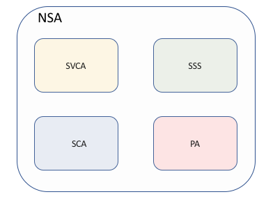
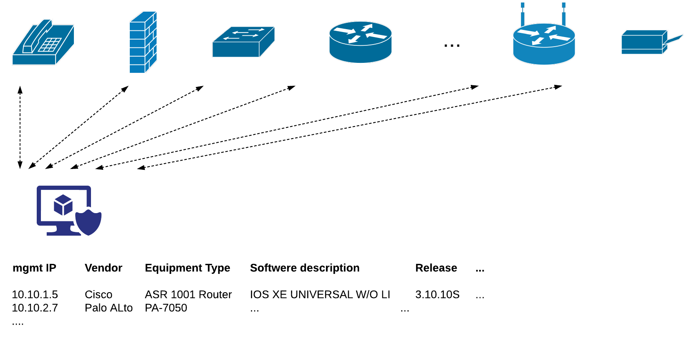
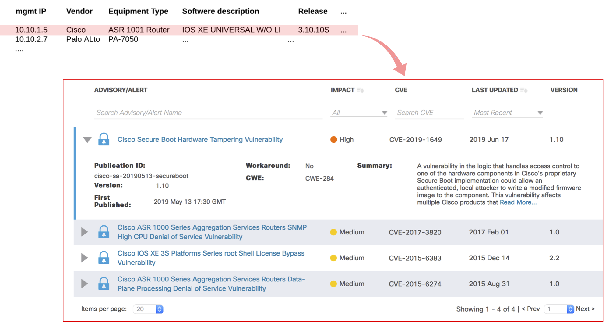
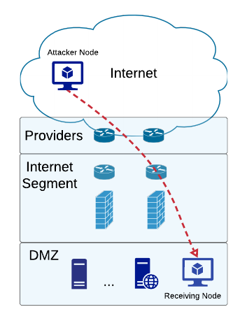
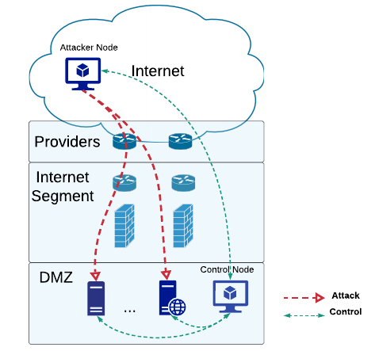

# Network Security Adviser (NSA)

## Modules

Consists of several modules:

- Software Version Control and Adviser (SVCA)
- Smart Security Scanner (SS)
- Security Configuration Analyser (SCA)
- Policies Analyser (PA)
- ...

### Software Version Control and Adviser 

- Automatically collects information about software/hardware of devices

  

- Taking into account the information about software/hardware versions provides up-to-date information about bugs and vulnerabilities

- Provides recommendations about upgrades/updates/patches based on

  - bugs and vulnerabilities reports
  - hardware (disc space, RAM,...)
  - software version level of stability
- (Optional) Integrated with a calendar to track the end of support contracts

### Smart Security Scanner

Depending on licenses may scan the following security features:

- application firewalling
- threat prevention (antivirus, anti-spyware, and vulnerability)
- URL filtering
- data filtering (content filtering)
- file blocking (file types blocking)
- dos protection

Three different probes may be used. The first two are attacks with a feedback, and the last one - without.

- __Attack with receiver__. Two types of nodes are used: attacking node and receiving node.
  Attacks are simulated by the attacking node from the Internet in the direction of the receiving node. Thus, we can test  the effectiveness of our perimeter security policies.

- __Attack with control__. Two types of nodes are used: attacking node and control node.
  Attacks are simulated by the attacking node from the Internet towards the applications. The control node is used 
  - to test the effectiveness of the attack (by measuring of cpu, memory utilisation, ..)
  - prevent significant degradation of services (the attack is terminated in case of reaching the thresholds)

- __Attack without feedback__.Only one attacker node is used. In this case SSS is acting like a usual security scanner.

### Security configuration analyser

Based on vendors hardening requirements

- analyses equipment configuration

  Usually vendors provide recommendations for secure configuration (hardening).  
  SCA verifies that the current configuration fits these and other security best practices requirements. 

- provides recommendations on how to improve configuration security

### Policies analyser

Analysing the current routing tables and the configuration of the equipment creates the matrix of accesses between subnets in your network. It permits you to have actual and real time information about all accesses and access changes in your network.

API permits you automatically extract the data and compare it with your expectations (somehow documented list of approved policies)

